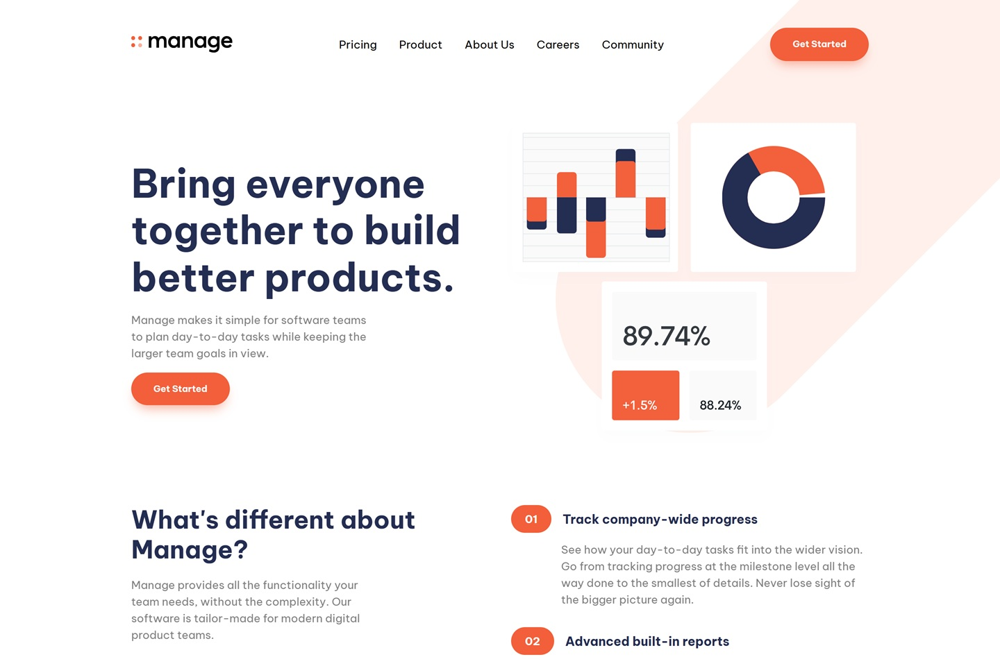

# Frontend Mentor - Manage Landing Page Solution

This is my solution to the **Manage Landing Page** challenge on Frontend Mentor. The objective of this project is to recreate a responsive landing page for Manage while practicing React component architecture, reusable UI components, responsive layouts, form validation, and interactive testimonial carousels.

## Preview



## Links

- **Live Site:** https://manage-landing-page-five-lyart.vercel.app/
- **Frontend Mentor Challenge:** https://www.frontendmentor.io/challenges/manage-landing-page-SLXqC6P5

## Built With

- React 19
- Vite
- JavaScript (ES6+)
- CSS
- Flexbox
- CSS Grid
- CSS Custom Properties
- Responsive Design
- React Hooks (`useState`, `useEffect`)
- Embla Carousel
- SVG
- Google Fonts (Be Vietnam Pro)

## Layout

The original design was created for the following viewport widths:

- **Mobile:** 375px
- **Desktop:** 1440px

The landing page uses a mobile-first approach and adapts its layout for larger screens. On desktop, the navigation, hero section, feature section, testimonials, CTA, and footer are arranged to match the original design, while the mobile layout uses a collapsible navigation menu and testimonial carousel.

The responsive layout uses a breakpoint at **896px** (`56rem`) to transition between mobile and desktop layouts.

## Style Guide

### Colors

#### Primary

| Color | HSL |
|--------|-----|
| Orange 400 | `hsl(12, 88%, 59%)` |
| Blue 950 | `hsl(228, 39%, 23%)` |

#### Neutral

| Color | HSL |
|--------|-----|
| Gray 950 | `hsl(233, 12%, 13%)` |
| Orange 50 | `hsl(13, 100%, 96%)` |
| Gray 50 | `hsl(0, 0%, 98%)` |

### Typography

**Body Copy**

- **Font Family:** Be Vietnam Pro
- **Base Font Size:** `16px`
- **Font Weight:** 400

**Headings and Buttons**

- Headings use the **Be Vietnam Pro** font family.
- Buttons and navigation elements use a heavier font weight of **700**.

## Project Structure

```text
├── public
│   └── favicon.png
├── src
│   ├── components
│   │   ├── layout
│   │   │   ├── Footer.jsx
│   │   │   ├── MobileMenu.jsx
│   │   │   └── NavBar.jsx
│   │   ├── sections
│   │   │   ├── CtaSection.jsx
│   │   │   ├── FeatureSection.jsx
│   │   │   ├── HeroSection.jsx
│   │   │   └── TestimonialsSection.jsx
│   │   └── ui
│   │       ├── Button.jsx
│   │       ├── Container.jsx
│   │       └── Logo.jsx
│   ├── data
│   │   ├── featuresData.js
│   │   ├── navLinks.js
│   │   └── testimonialsData.js
│   ├── images
│   │   ├── avatar-ali.png
│   │   ├── avatar-anisha.png
│   │   ├── avatar-richard.png
│   │   ├── avatar-shanai.png
│   │   ├── bg-simplify-section-desktop.svg
│   │   ├── bg-simplify-section-mobile.svg
│   │   ├── bg-tablet-pattern.svg
│   │   ├── icon-close.svg
│   │   ├── icon-facebook.svg
│   │   ├── icon-hamburger.svg
│   │   ├── icon-instagram.svg
│   │   ├── icon-pinterest.svg
│   │   ├── icon-twitter.svg
│   │   ├── icon-youtube.svg
│   │   ├── illustration-intro.svg
│   │   └── logo.svg
│   ├── styles
│   │   ├── base.css
│   │   ├── components.css
│   │   ├── layouts.css
│   │   └── sections.css
│   ├── App.jsx
│   ├── index.css
│   └── main.jsx
├── eslint.config.js
├── index.html
├── package-lock.json
├── package.json
├── preview.jpg
├── README.md
└── vite.config.js
```

## React Components

The application is structured into reusable components to separate layout, UI elements, and page sections.

| Component | Responsibility |
|-----------|----------------|
| `NavBar` | Displays the desktop navigation and controls the mobile menu |
| `MobileMenu` | Displays the mobile navigation overlay |
| `Footer` | Displays footer navigation, social links, newsletter form, logo, and copyright |
| `HeroSection` | Displays the main hero content and illustration |
| `FeatureSection` | Displays Manage's key features |
| `TestimonialsSection` | Displays customer testimonials using an interactive carousel |
| `CtaSection` | Displays the final call-to-action section |
| `Button` | Reusable button component with multiple variants |
| `Container` | Reusable layout container for consistent page spacing |
| `Logo` | Reusable Manage logo component |

The main application composes these components into the complete landing page:

```jsx
function App() {
    return (
        <>
            <NavBar />

            <main>
                <HeroSection />
                <FeatureSection />
                <TestimonialsSection />
                <CtaSection />
            </main>

            <Footer />
        </>
    )
}
```

## What I Practiced

Through this project, I practiced:

- Building a responsive React landing page with Vite.
- Structuring a React application into reusable components.
- Creating reusable UI components such as buttons, containers, and logos.
- Separating content from presentation using data files.
- Managing interactive UI state with `useState`.
- Handling side effects with `useEffect`.
- Implementing a responsive mobile navigation menu.
- Building an interactive testimonial carousel with Embla Carousel.
- Implementing client-side email validation.
- Using semantic HTML and ARIA attributes for accessibility.
- Combining Flexbox and CSS Grid for responsive layouts.
- Organizing CSS into separate files based on responsibility.
- Using CSS custom properties for design tokens.
- Implementing responsive layouts with a mobile-first approach.

## Author

- GitHub - [@shrigel](https://github.com/shrigel)
- Frontend Mentor - [@shrigel](https://www.frontendmentor.io/profile/shrigel)